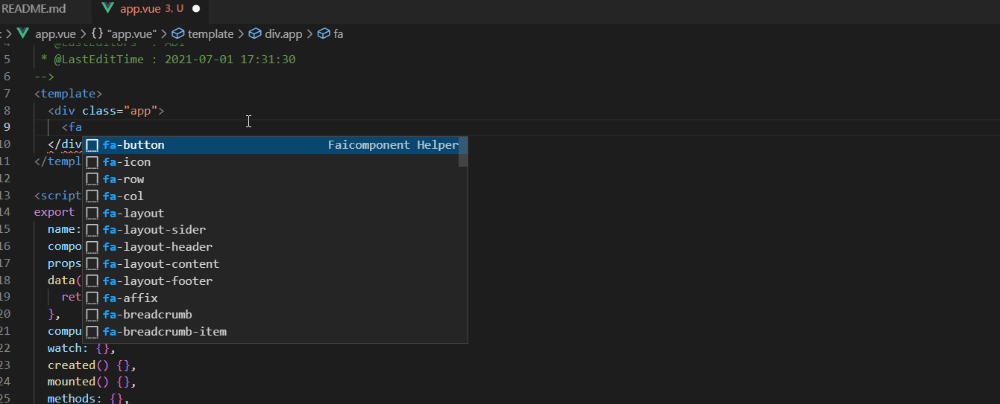
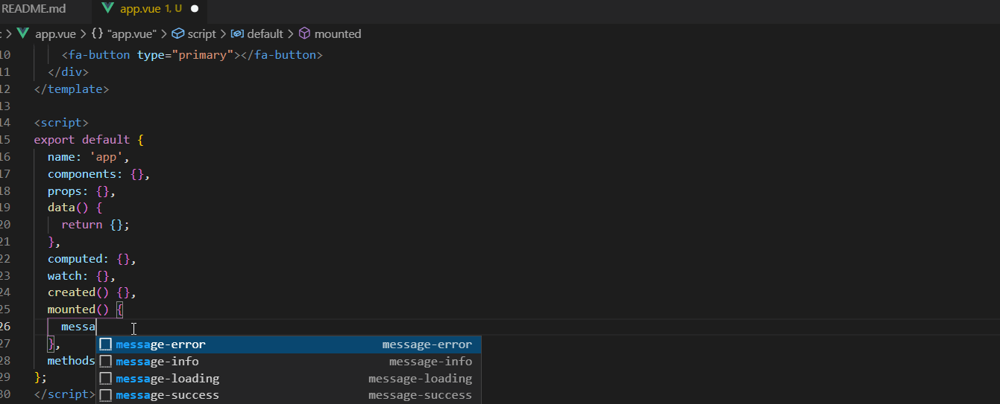
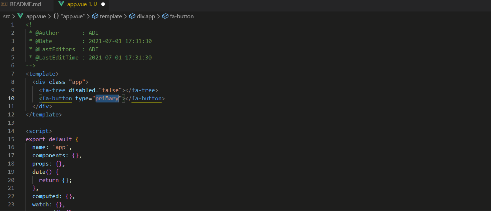

# faicomponent-helper

> faicomponent-helper is a VS Code extension for Faicomponent Helper.

## Feature

* Document

* Snippets

## Document

### Usage

* Move cursor to Faicomponent Helper tag or select it

* Press default hot key `shift + cmd + i`(windows: `shift + win + i`) to bring up the Command Palette and then input `faicomponent-helper.search`

* Show document view If complete matching,
    or you should select tag you want to search

* Enter and trigger document browser

## Contribution

Your pull request will make faicomponent-helper better.

## LICENSE

MIT

